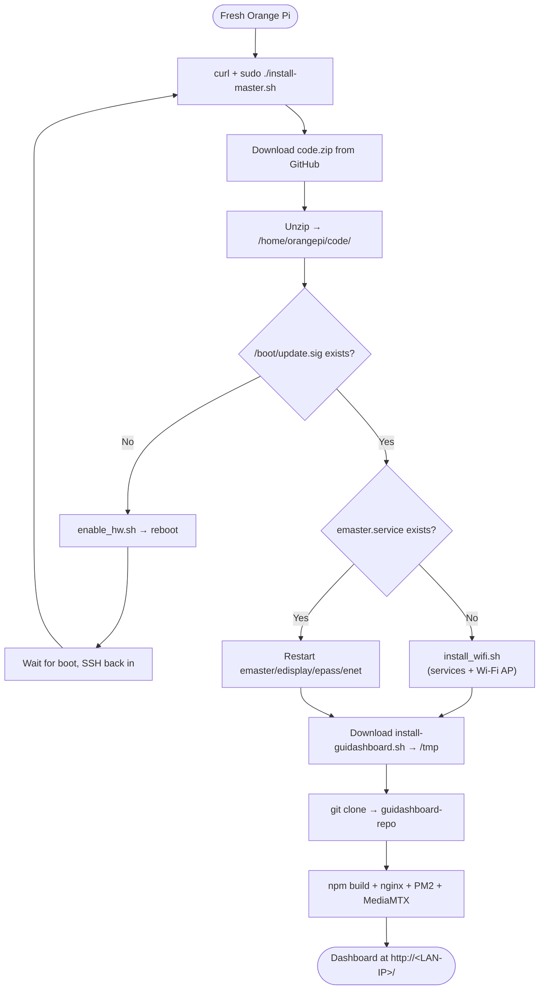
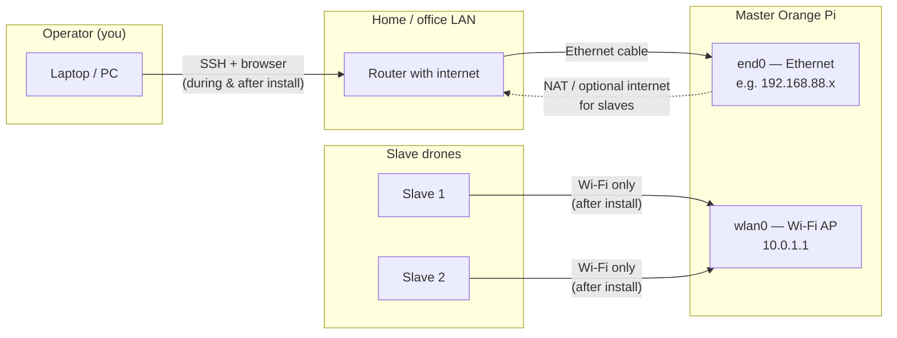

# Foxy Mission Control

Web dashboard and ground-station stack for Orange Pi master units. The repo contains the React GUI (`guidashboard`), Node.js API, MediaMTX streaming config, and install scripts used to provision a master Orange Pi from a fresh image.

**Current dashboard version:** 4.6.0

---

## Master Orange Pi — quick install

On a **fresh** Orange Pi (logged in as `orangepi`, with internet access), run **the same command twice**. The first run enables hardware overlays and **reboots**; the second run finishes Wi‑Fi/AP setup and installs the dashboard.

```bash
cd /home/orangepi && curl -fsSL "https://raw.githubusercontent.com/orbitaloredivision/foxymissioncontrol/main/tools/install/install-master.sh" -o install-master.sh && chmod +x install-master.sh && sudo ./install-master.sh
```

| Run | What happens | Expected result |
|-----|----------------|-----------------|
| **1** | Downloads `shared/code.zip`, runs `enable_hw.sh`, reboots | Pi reboots; dashboard **not** installed yet |
| **2** | Runs `install_wifi.sh` (systemd + AP), then `install-guidashboard.sh` | Full master + dashboard (~10–20 min) |

**Before run 1:** plug master **`end0` Ethernet** into a router with internet. **Slaves stay off** until install completes — see [Network setup](#network-setup--when-to-connect-master-and-slaves).



### After install — verify

Replace `<LAN-IP>` with the address on `end0` (e.g. `192.168.88.41` from your router/DHCP).

```bash
# Run 1 completed (before dashboard exists)
test -f /boot/update.sig && echo "hardware OK"
grep '^overlays=' /boot/orangepiEnv.txt

# Run 2 completed
curl -sf http://localhost/api/health
systemctl is-active emaster edisplay epass enet nginx mediamtx
sudo -u orangepi pm2 list
```

Open in a browser: **http://`<LAN-IP>`/** — version should match the repo (e.g. **4.6.0**).

OLED status letters (when blinking): **E** ELRS · **S** slave link · **C** console/API · **M** MediaMTX. After a successful install, **C** and **M** should clear.

---

## Network setup — when to connect master and slaves

The master uses **two networks at once**. Operator gear and slave drones use **different interfaces** — connect them at the right phase of setup.



### Roles of each connection

| Connection | When | Who connects | Purpose |
|------------|------|--------------|---------|
| **`end0` Ethernet → router** | **Before run 1** through end of install | Master Pi | Internet for `curl`/git/npm; SSH and dashboard access from your PC on the LAN |
| **`wlan0` Wi‑Fi AP** | Created automatically during **run 2** | **Slave drones only** | Drone control network (`10.0.1.x`); not for operator SSH |
| **Slave Wi‑Fi → master AP** | **After install is complete** | Each slave | Pairing, telemetry, video streams |
| **Slave on same LAN as `end0`** | Optional alternative | Slaves with Ethernet or LAN Wi‑Fi | Discovery also scans the `end0` subnet — works if slaves share the router network |

### Timeline (fresh master)

| Phase | Master wiring | Slaves | Your laptop |
|-------|---------------|--------|-------------|
| **Before run 1** | Plug **Ethernet** (`end0`) into a router/switch with **internet** | Off or not needed | SSH to master via LAN IP (or direct cable + static IP if no DHCP) |
| **Run 1** | Keep `end0` online | Not needed | Same SSH session; Pi **reboots** at end |
| **After reboot (run 2)** | Keep `end0` online | Still not needed | SSH again on **`end0` LAN IP** (check router DHCP) |
| **During run 2** | `init_ap.sh` starts Wi‑Fi AP; networking may **restart** | Not needed | SSH may drop ~30 s — **reconnect on LAN IP**, not on the master AP |
| **Install complete** | `end0` = operator access; `wlan0` = AP running | Power on; join master AP | Browser → `http://<end0-LAN-IP>/` |
| **Pairing** | Both interfaces stay as-is | Each slave on **`MASTER_…` Wi‑Fi** | Dashboard → **Discover** → **Pair** |

### Master Wi‑Fi access point (for slaves)

During run 2, `install_wifi.sh` runs `init_ap.sh`, which turns **`wlan0`** into an access point:

| Setting | Value |
|---------|--------|
| AP IP | `10.0.1.1` |
| SSID | `MASTER_<suffix>` — suffix = last 9 hex chars of `wlan0` MAC (uppercase) |
| Password | `11111111` |
| Slave DHCP | `10.0.1.10` – `10.0.1.255` |

Find your SSID on the master:

```bash
grep ^ssid= /etc/hostapd/hostapd.conf
# example: ssid=MASTER_022CA3F0E
```

AP is re-applied on **every boot** (cron `@reboot`). **`10.0.1.1` is permanent by design** — it is the drone subnet, not a temporary install address.

### Connecting slave drones

1. **Finish master install first** (both runs). Confirm `curl http://localhost/api/health` on the master.
2. **Power on a slave** with Wi‑Fi enabled.
3. On the slave, join the master AP:
   - **SSID:** `MASTER_<suffix>` (from command above)
   - **Password:** `11111111`
4. Wait until the slave gets a `10.0.1.x` address (usually automatic via DHCP).
5. On your PC (still on the **LAN**, browser pointed at the master):

   Open the dashboard → drone profiles → **Discover** → select the slave → **Pair**.

   Discovery uses UDP broadcast on all active master subnets (`10.0.1.255`, plus the `end0` LAN broadcast if present). Slaves on the master AP are the normal case.

6. Repeat for each slave. Paired drones are stored in `/home/orangepi/guidashboard/drone-profiles.json`.

**Direct pair (known IP):** if discovery does not list a slave, use **Direct pair** in the dashboard and enter the slave’s IP (e.g. `10.0.1.42`).

**CLI (on master):**

```bash
cd /home/orangepi/code
./pair.sh <slave-ip> <drone-id>
```

### Operator access — do / don’t

| Do | Don’t |
|----|--------|
| SSH and open the dashboard via **`end0` LAN IP** (e.g. `192.168.88.41`) | Use **`10.0.1.1`** for SSH or the web UI — that is the AP side for slaves |
| Keep **`end0` on a router with internet** during install | Rely on the master AP for internet during install — it does not exist until run 2 |
| Reconnect on the **same LAN IP** if SSH drops during run 2 | Assume the Pi is dead — networking restart is expected |

### Field use (no internet on site)

After install, the master **can operate without internet** on `end0`:

- Slaves only need **`wlan0` AP** (`MASTER_…` / `10.0.1.x`).
- Your laptop only needs reachability to the master **`end0` IP** on a local switch or direct Ethernet — internet is optional.
- OLED **E** may indicate no uplink; core drone control still works on the AP.

Internet on `end0` is **required only for install/upgrade** (GitHub, npm, git).

---

## What gets installed

| Component | Location | Role |
|-----------|----------|------|
| Master Python services | `/home/orangepi/code/` | ELRS, pairing, discovery, OLED, telemetry DB |
| systemd units | `emaster`, `edisplay`, `epass`, `enet` | Background services |
| Dashboard repo clone | `/home/orangepi/guidashboard-repo/` | Source (frontend + server) |
| Backend API | `/home/orangepi/guidashboard/` | Express + SQLite, managed by PM2 |
| Frontend | `/var/www/html/` | Built static files served by nginx |
| MediaMTX | `/home/orangepi/mmtx/` | RTSP/HLS/WebRTC for camera streams |
| Install scripts (ephemeral) | `/tmp/install-guidashboard.sh` | Downloaded each run from GitHub; not kept on disk |

See **[Network setup — when to connect master and slaves](#network-setup--when-to-connect-master-and-slaves)** for the full wiring timeline.

### Network layout (by design)

| Interface | Typical address | Purpose |
|-----------|-----------------|--------|
| `end0` | e.g. `192.168.88.x` | LAN — SSH and browser access to dashboard |
| `wlan0` | `10.0.1.1` | Wi‑Fi AP for slave drones (`MASTER_<MAC>`, password `11111111`) |

`init_ap.sh` runs on boot (via cron from `install_wifi.sh`). SSH may drop briefly while networking restarts during **run 2** — reconnect on the **LAN IP** (`end0`), not `10.0.1.1`.

Slaves should use **Wi‑Fi to the master AP** after install. Operators use **Ethernet/LAN on `end0`** for SSH and the browser.

---

## Prerequisites

- Orange Pi image with user **`orangepi`** (default images)
- **Ethernet (`end0`) to a router with internet** for install (runs 1 and 2)
- **Writable** root filesystem (`curl: (23)` or write errors → remount rw or reflash SD)
- **Two runs** of the install command on a truly fresh unit (hardware step requires reboot)
- Slave drones are **not** required until after install; connect them to the master AP only when pairing

Optional: set a Google Maps key before dashboard install (otherwise map shows a dev watermark):

```bash
export GOOGLE_MAPS_API_KEY="your-key"
sudo -E ./install-master.sh
```

---

## Partial install & other cases

Use these when the full two-run flow is not what you need.

### Dashboard only (master services already installed)

If `/home/orangepi/code/` and systemd services are already OK (e.g. run 2 failed only at guidashboard):

```bash
cd /home/orangepi && curl -fsSL "https://raw.githubusercontent.com/orbitaloredivision/foxymissioncontrol/main/tools/install/install-guidashboard.sh" -o install-guidashboard.sh && chmod +x install-guidashboard.sh && sudo ./install-guidashboard.sh -y
```

### Re-run after SSH dropped during run 2

Networking restart from `install_wifi.sh` / `init_ap.sh` can disconnect SSH mid-install. Reconnect on **`end0` LAN IP**, then run the **same master command** again (or dashboard-only above). Already-finished steps are skipped or safely restarted.

### Clean reinstall dashboard only

```bash
sudo ./install-guidashboard.sh -reinstall -y
```

### Remove dashboard stack

```bash
sudo ./install-guidashboard.sh -uninstall -y
```

Does not remove `/home/orangepi/code/` master Python services.

### Upgrade existing dashboard

From the device (after first install):

```bash
/home/orangepi/guidashboard-repo/tools/run-upgrade.sh
```

Or use the **Upgrade** action in the web UI (requires `setup-upgrade-wrapper.sh`, run automatically at end of a successful master install).

### Pin install to a branch or fork

```bash
export REPO_RAW="https://raw.githubusercontent.com/orbitaloredivision/foxymissioncontrol/main"
sudo -E ./install-master.sh
```

---

## Troubleshooting

| Symptom | Likely cause | Fix |
|---------|----------------|-----|
| `curl: (23) Failure writing output` | Read-only filesystem | `sudo mount -o remount,rw /` or reflash SD |
| `enable_hw.sh: No such file` | Bad `code.zip` layout | Use current `main` branch (includes `normalize_code_tree`) |
| `npm error EACCES` on backend install | Root-owned `~/.npm` | `sudo chown -R orangepi:orangepi /home/orangepi/.npm` then re-run guidashboard install |
| PM2 `Permission denied` on `.pm2/rpc.sock` | Root-owned PM2 sockets | `sudo chown -R orangepi:orangepi /home/orangepi/.pm2` and remove stale `*.sock`, then re-run |
| Install stuck ~10–20 min at backend npm | `better-sqlite3` compiling on ARM | Normal; wait for heartbeat logs |
| Can't SSH after install | Connected to AP instead of LAN | Use **`end0` IP** (e.g. `192.168.88.x`), not `10.0.1.1` |
| Slave not in Discover | Slave not on master AP / not powered | Join slave to `MASTER_…` Wi‑Fi; confirm `10.0.1.x`; retry Discover |
| OLED shows **S** | No paired / linked slave | Pair at least one drone; check slave on master AP |
| OLED shows **C** or **M** | API or MediaMTX down | Check `pm2 list`, `systemctl status mediamtx`, `curl localhost/api/health` |

Recent `install-guidashboard.sh` releases fix npm cache and PM2 home ownership automatically when the script is run as root; manual `chown` is only needed if an older installer left mixed ownership.

---

## Repository layout (install-related)

```
tools/install/install-master.sh      # Full master + dashboard bootstrap
tools/install/install-guidashboard.sh # Dashboard, nginx, PM2, MediaMTX
tools/run-upgrade.sh                 # Re-fetch installer and upgrade
shared/code.zip                      # Master Python/service bundle
```

---

## Local development (optional)

For hacking the React app on a dev machine:

```bash
npm install
npm run dev          # frontend dev server
npm run server       # API on port 3001 (requires native better-sqlite3)
npm run build        # production build → dist/
```

Deploy to a known Pi: `npm run deploy:dev` (configure host in `deploy-to-orangepi.sh` / env).

---

## License

See repository defaults and bundled third-party licenses (e.g. MediaMTX under `master/home/orangepi/mmtx/`).
